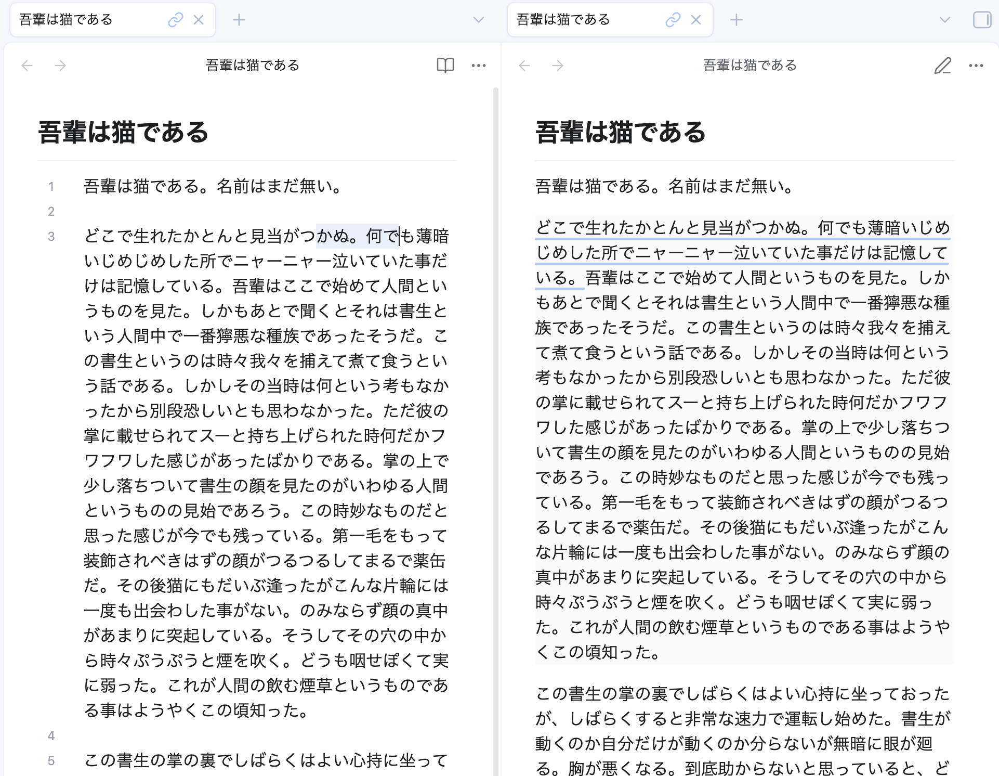
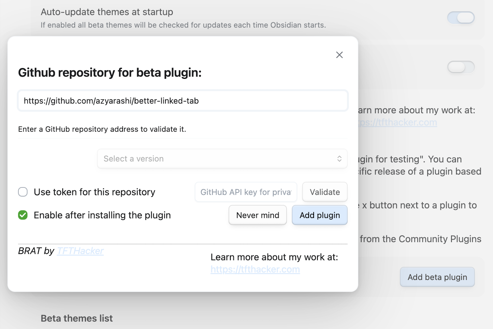
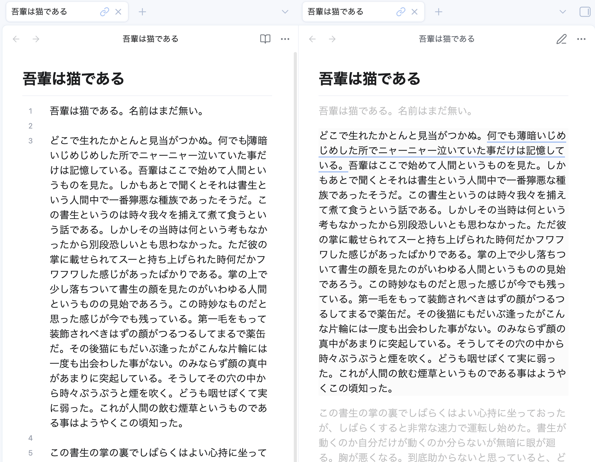

# Better Linked Tab

<a href="https://obsidian.md/">
  
</a>

Enhances the synchronization and visual feedback between linked tabs in [Obsidian](https://obsidian.md).

[](./assets/demo.png)

---

## Features

- Highlight the active section or sentence (press <kbd>ESC</kbd> to clear the highlight)

There are still only a few features available. Please suggest improvements via Issues or PRs.

## Installation

Currently, it's under review for the official plugin list. This process may take several months.
Until then, please install using the community plugin [BRAT](https://obsidian.md/plugins?id=obsidian42-brat).

1. Install BRAT.
2. Add this repository: `azyarashi/better-linked-tab`.
3. Link two tabs (one Source, one Preview) to see it in action.

[](#install-with-brat)

## Custom Styling

You can further customize the appearance using CSS snippets.

### CSS Classes

| Class Name | Description |
| --- | --- |
| `.betterlinkedtab-section` | Applied to every section in Preview Mode. |
| `.betterlinkedtab-sentence` | Applied to every sentence within a section. |
| `.is-active` | Added to the active section/sentence. |
| `.mode-highlight` | Active when **Highlight** mode is selected. |
| `.mode-underline` | Active when **Underline** mode is selected (sentences only). |
| `.mode-indicator` | Active when **Indicator** mode is selected (sections only). |

### Styling Examples

1. Dim all inactive sections

```css
.betterlinkedtab-section:not(.is-active) {
    opacity: 0.3;
    transition: opacity 0.5s ease;
}
```

[](./assets/example1.png)

## Disclosures

This section contains wording required for publishing on Obsidian's official Community Plugins page.

This plugin does not access the network or read your local files.
